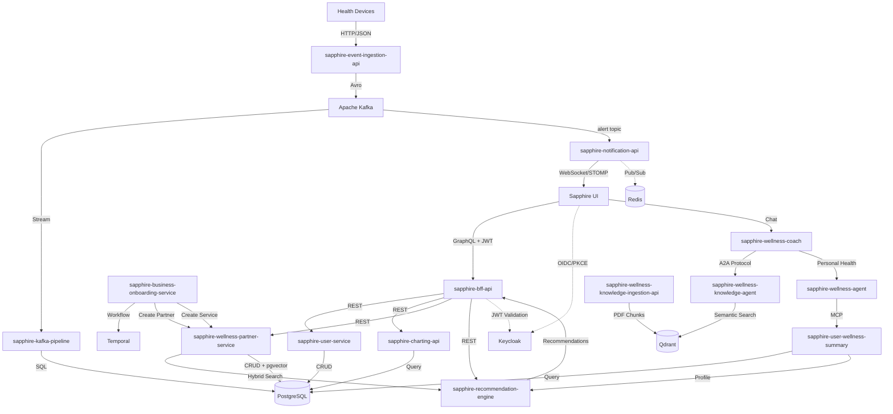

# Sapphire Workspace — System Context

This file describes the system landscape of the Sapphire workspace.
For governing principles, code quality standards, testing requirements, UX rules, and performance budgets, see `.specify/runtime/effective-constitution.md`.

## Repos

| Repo | Role | Language/Framework |
|---|---|---|
| **Sapphire** | React frontend with Keycloak OIDC auth, Apollo GraphQL client, health dashboard UI | TypeScript/React/Vite |
| **sapphire-bff-api** | GraphQL BFF aggregating backend REST APIs, Keycloak JWT validation, WebSocket subscriptions | Node.js/Express/Apollo Server |
| **sapphire-user-service** | User management, subscriptions, wellness summaries with PostgreSQL | Java 17/Spring Boot |
| **sapphire-wellness-partner-service** | B2B partner/service onboarding with pgvector embeddings, entitlements, JSONB metadata | Java 17/Spring Boot/PostgreSQL |
| **sapphire-recommendation-engine** | Stateless hybrid recommendation scoring (keyword + semantic + rule-based) | Java 17/Spring Boot |
| **sapphire-notification-api** | Real-time WebSocket notifications from Kafka with Spring STOMP, user-specific routing | Java 17/Spring Boot/Kafka |
| **sapphire-charting-api** | Health metrics charting and visualization service | Java 17/Spring Boot |
| **sapphire-event-ingestion-api** | High-throughput health telemetry ingestion with Avro schemas, Kafka producer, OTLP tracing | Python/FastAPI/Kafka |
| **sapphire-kafka-pipeline** | Kafka Connect sink connectors streaming health metrics to PostgreSQL timeseries tables | Kafka Connect/PostgreSQL |
| **sapphire-user-wellness-summary** | Generates two-line wellness summaries (rule-based or AI-based) from PostgreSQL telemetry | Python/FastAPI/Ollama |
| **sapphire-wellness-coach** | Conversational AI coach with intelligent routing to knowledge agent via A2A protocol | Python/LangGraph/Ollama/FastAPI |
| **sapphire-wellness-knowledge-agent** | A2A-compliant agent with PDF ingestion, Qdrant semantic search, spaCy tagging | Python/A2A Protocol/FastAPI/Qdrant |
| **sapphire-business-onboarding-service** | Temporal workflow orchestration for partner/service onboarding with signal-based approvals | Java 17/Spring Boot/Temporal |
| **sapphire-wellness-partner-service** | A comprehensive Spring Boot-based B2B API for managing wellness partners and their services with support for metadata (labels, annotations, tags, and links). | Java 17/Spring Boot |
| **sapphire-playwright** | E2E test scenarios for user journeys (premium, subscriptions, upgrades) | TypeScript/Playwright |
| **sapphire-k6** | K6 load testing with file writer server for capturing request JSONs | K6/JavaScript/Node.js |
| **sapphire-k6-bootstrap** | K6 bootstrap data generator for 7 days of health metrics with Keycloak auth | K6/JavaScript/Node.js |
| **sapphire-fitconnect-agents-deep-eval** | DeepEval framework for agent evaluation (relevancy, faithfulness, hallucination, MCP tools) | Python/DeepEval/OpenAI |
| **sapphire-partner-service-search** |Hybrid (Semantic + BM25 search for partner services) | Java 17/Spring Boot |
| **recommendation-workflow-service** |Temporal workflow to generate recommendations | Java 17/Spring Boot |
| **sapphire-wellness-mcp** |A MCP Service providing tools to get an User's Telemetry | FastMCP/ Python |
| **sapphire-user-mcp** |A MCP Service providing tools to get an User's Profile, Alerts, Recommendations | FastMCP/ Python |
| **sapphire-fitconnect-agents-deep-eval** |Evaluation framework for the agents using DeepEval | Python/ DeepEval |
| **sapphire-embedding-service** |A stateless, generic embedding service built with Spring Boot that generates vector embeddings using Ollama. | Java 17/Spring Boot/Ollama |
| **sapphire-kafka-pipeline** |A Kafka Connect pipeline for streaming health telemetry data from Kafka topics to a PostgreSQL timeseries database. | JSON |
| **sapphire-kafka-streams-consumer** |A Kafka Stateful Streaming, generating near real time alerts and saving to Kafka Topic | Java 17/Spring Boot/ Kafka Streams |

## Repos by components

The following table provides a high-level grouping of repositories by component.

| Component Name |  Service Name | Service Description |  Repo Name | 
| -------------- |  -------------| --------------------|  -------- |
| Sapphire Web UI| Sapphire Web UI | A Web User Interface for Sapphire FitConnect Product | Sapphire|
| Authentication Provider | Sapphire Keycloack Realm | A Keycloack realm to support client registration, OIDC and OAuth2 flows ||
| Sapphire BFF |  Sapphire BFF |  A GraphQL based Backend for Front End between Sapphire Web UI and Backend Services - uses a Schema, resolvers like Query, Mutation & Subscription| sapphire-bff-api|
| Sapphire Health Telemetry Ingestion, Analysis & Alerting | Telemetry Ingestion API | A REST API - loads the Telemetry into Kafka |sapphire-event-ingestion-api |
|                                                          | Telemetry Ingestion Long Term | A Data pipeline, based on Kafka Connect, Kafka as source and PostgreSQL as Sink, PostgreSQL with time series database extension, TimeScaleDB, Hypertables | sapphire-kafka-pipeline|
|  |  Telemetry Analysis Service | A REST API, helps produce Telemetry charts supporting Timeseries capabilities | sapphire-charting-api|
|   | Telemetry Alerting Generation Service | A Kafka Stateful Streaming, generating near real time alerts and saving to Kafka Topic |sapphire-kafka-streams-consumer|
|   | Telemetry Alert Delivery Service | Contains a Kafka Consumer reading from Alert Kafka Topic, Delivering to a Redis Pub Sub, A Websocket API and saving the alert for Long Term in User Management Component - My Alerts | sapphire-notification-api|
| | Health and Wellness Telemetry MCP Service | A MCP Service providing tools to get an User's Telemetry | sapphire-wellness-mcp |
| User Management | User Profile Service | A CRUD REST API based service backed by PostGreSQL database for storing User details like Profile, Alerts, Recommendations and purchased Service Plans| sapphire-user-service|
| | Wellness Profile Builder Service | A CRUD REST API based component which can analyze user telemetry and additional demography and generate a succint profile description | sapphire-user-wellness-summary|
| | User Profile MCP Service |  A MCP Service providing tools to get an User's Profile, Alerts, Recommendations | sapphire-user-mcp |
| Wellness Partner & Service Management | Wellness Partner & Service | A REST API based component backed by PostGreSQL database for CRUD for a Wellness Partner entity | sapphire-wellness-partner-service|
| | Wellness Plan Search Service | A REST API with  powerful hybrid search endpoint - supporting BM25 and Semantic search by pg_textsearch and pgvector extension. We will use embedding model from ollama  and use it for pgvector embedding| sapphire-partner-service-search|
| | Wellness Partner & Service On-boarding Service | A REST API encapsulating a Temporal Workflow for a long running business process - approvals, state changes based on Web Hooks | sapphire-business-onboarding-service|
| Recommendation Management | Recommendation Engine  | Stateless Service API (REST) that generates partner-service recommendations from user profile telemetry summary and hybrid search  (keyword + semantic) of registered wellness services from platform partners using cosine similarity algorithm. | sapphire-recommendation-engine|
| | Recommendation Workflow Service | A REST API service that uses Temporal to orchestrate a multi-step recommendation pipeline for Sapphire wellness users. A single REST call triggers a durable workflow that fetches a user's health profile, searches for matching services, retrieves AI-generated recommendations, deduplicates them against existing ones, and persists the result| recommendation-workflow-service|
| Sapphire Wellness Buddy |  Wellness Coach Agent | An Agentic AI application, can help with users wellness metrics data, profile summary, get recommendation, buy service plan as well. Also route to Wellness Knowledge Agent via A2A client server for genetric wellness questions| sapphire-wellness-knowledge-agent|
| | Wellness Knowledge Agent  | An Agentic RAG application, which has a retrieval pipeline exposed as an A2A Server, implemented using Langgraph and a Vector Database. A Langchain based Document Indexing Pipeline with Embedding Model and Vector Database| sapphire-wellness-coach|
| Sapphire Technical Services | Document Embedding Service | A genetic REST based API which can take a content, embedd and return back the embedding | sapphire-embedding-service|
|  | Data Bootstrap Service (Backend APIs)| Grafana K6 based scripts that can create Health Metrics (i.e user activities etc) based on few available Persona Types, it also can do a service data bootstrap| sapphire-k6-bootstrap |
|  | Sapphire Embedding API | Stateless API to create embeddings | sapphire-embedding-service |
|  | Sapphire Kafka Pipeline | Kafka connect configuration for PostgreSQL sink connector | sapphire-kafka-pipeline |

## Implementation Guidelines

1. When implementing any new feature, understand the codebase pattern and implement it in a similar way. Align to existing specs and schemas. Do not introduce a new pattern if not required.
2. For the impacted codebase, always try to find out the minimum changes needed.
Never silently swallow errors. Either handle them explicitly or let them propagate — no empty catch blocks or suppressed exceptions.
3. Do not hardcode environment-specific values (URLs, credentials, timeouts). Use config or environment variables.
4. Never modify or delete data without a clear, reversible path — prefer soft deletes and idempotent operations.
5. Before making changes, trace the full call path — from entry point to data layer. Do not assume behavior from naming alone.
6. If a task is ambiguous, state your assumptions explicitly before proceeding, rather than silently picking one interpretation.
7. Do not refactor code that is not in scope for the current change, even if it looks messy.

## Task Routing By Repo

| Request Type | Primary Repo | Common Secondary Repos |
|---|---|---|
| UI pages, dashboard UX, OIDC client behavior | `Sapphire` | `sapphire-bff-api`, `sapphire-playwright` |
| GraphQL schema/resolvers/aggregation | `sapphire-bff-api` | `Sapphire`, backend service repo being aggregated |
| User profile/subscription domain | `sapphire-user-service` | `sapphire-bff-api`, `Sapphire` |
| Partner/service catalog and entitlements | `sapphire-wellness-partner-service` | `sapphire-recommendation-engine`, `sapphire-bff-api` |
| Recommendation ranking logic | `sapphire-recommendation-engine` | `sapphire-user-wellness-summary`, `sapphire-wellness-partner-service`, `sapphire-bff-api` |
| Real-time alerts and websocket delivery | `sapphire-notification-api` | `sapphire-bff-api`, `Sapphire`, `sapphire-kafka-pipeline` |
| Health metrics chart generation | `sapphire-charting-api` | `sapphire-bff-api`, `Sapphire` |
| Telemetry ingestion and Kafka publish | `sapphire-event-ingestion-api` | `sapphire-kafka-pipeline` |
| Kafka sinks/connectors and stream-to-Postgres | `sapphire-kafka-pipeline` | `sapphire-event-ingestion-api`, consuming services |
| AI coach orchestration/routing | `sapphire-wellness-coach` | `sapphire-wellness-agent`, `sapphire-wellness-knowledge-agent`, `Sapphire` |
| Knowledge retrieval and vector search | `sapphire-wellness-knowledge-agent` | `sapphire-wellness-knowledge-ingestion-api` |
| Knowledge ingestion/chunking/embeddings | `sapphire-wellness-knowledge-ingestion-api` | `sapphire-wellness-knowledge-agent` |
| Partner onboarding workflows/approvals | `sapphire-business-onboarding-service` | `sapphire-wellness-partner-service` |
| E2E user journeys | `sapphire-playwright` | `Sapphire`, `sapphire-bff-api` |
| Load and bootstrap testing | `sapphire-k6`, `sapphire-k6-bootstrap` | Target service repo |

## Data Flow

## Cross-Repo Workflows

1. **User Dashboard**: UI → BFF (GraphQL) → Backend Services (REST) → PostgreSQL
2. **Device Telemetry**: Devices → Ingestion API → Kafka → Kafka Connect → PostgreSQL
3. **Real-time Alerts**: Kafka → Notification API → WebSocket → UI
4. **AI Coaching**: UI → Wellness Coach → Knowledge Agent (A2A) / Wellness Agent (MCP)
5. **Recommendations**: Summary API → Recommendation Engine ← Partner Service (pgvector)
6. **Partner Onboarding**: Onboarding Service → Temporal Workflows → Partner Service
7. **Knowledge Base**: PDF Ingestion → Qdrant → Knowledge Agent (Semantic Search)

## Infrastructure

| Service | Purpose | Local Port |
|---|---|---|
| PostgreSQL | Primary DB for all Java services | 5432 |
| Kafka | Event bus (telemetry, alerts) | 9092 |
| Qdrant | Vector store for knowledge agents | 6333 |
| Redis | Notification pub/sub | 6379 |
| Keycloak | Auth (OIDC/PKCE) | 8090 |
| Temporal | Workflow orchestration | 7233 |